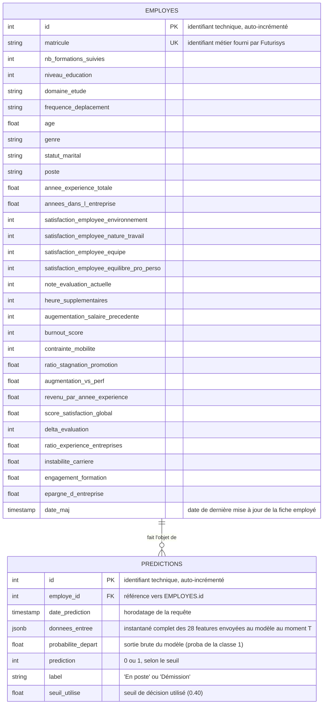

# Schéma de la base de données — Projet 5

Ce schéma décrit la structure de la base PostgreSQL utilisée pour enregistrer systématiquement les inputs et outputs du modèle de prédiction du turnover.

## Vue d'ensemble

- **EMPLOYES** : état courant des données RH de chaque employé, identifié par son matricule métier.
- **PREDICTIONS** : historique complet de chaque interaction avec le modèle, avec un instantané figé des données envoyées (traçabilité), lié à un employé via une clé étrangère.
- Relation : un employé peut avoir zéro ou plusieurs prédictions ; chaque prédiction appartient à exactement un employé.

## Notes de conception

- "id" (technique) est séparé de "matricule" (métier) pour ne pas coupler la clé primaire à un identifiant qui pourrait évoluer côté client.
- "EMPLOYES" ne conserve que l'état courant (pas de versionnement) : une mise à jour écrase les anciennes valeurs.
- "PREDICTIONS" reste auto-suffisante pour l'audit grâce à la colonne JSON "donnees_entree", qui capture les données exactes envoyées à chaque prédiction, indépendamment de l'évolution ultérieure de "EMPLOYES".
- "probabilite_depart", "prediction", "label", "seuil_utilise" sont des colonnes SQL dédiées (et non dans le JSON) car ce sont les champs les plus susceptibles d'être filtrés/triés/agrégés dans de futures analyses.

